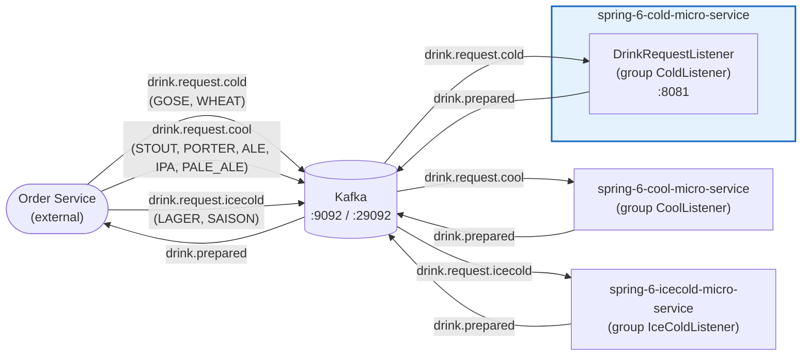

# Spring Framework 6: Beginner to Guru — Spring 6 Cold Microservice

Spring Boot 4 / Spring Framework 6 Kafka microservice on Java 25. It consumes `drink.request.cold`
events, simulates cold-drink preparation and publishes `drink.prepared` events back to Kafka.
Actuator endpoints are exposed on port `8081`.

## Architecture Overview

This service is one participant of the drink-preparation saga. An external order service routes
drink requests to one of three drink microservices based on the beer style. Each drink microservice
publishes a `drink.prepared` event once the drink is ready, which the order service consumes.



### Message Flow

|          Topic          |                    Produced by                    |                 Consumed by (group)                  |
|-------------------------|---------------------------------------------------|------------------------------------------------------|
| `drink.request.cold`    | order service (GOSE, WHEAT)                       | **this service** (`ColdListener`)                    |
| `drink.request.cool`    | order service (STOUT, PORTER, ALE, IPA, PALE_ALE) | `spring-6-cool-micro-service` (`CoolListener`)       |
| `drink.request.icecold` | order service (LAGER, SAISON)                     | `spring-6-icecold-micro-service` (`IceColdListener`) |
| `drink.prepared`        | all drink microservices                           | order service                                        |

## Prerequisites

|   Requirement   | Version  |
|-----------------|----------|
| Java            | 25       |
| Maven Wrapper   | included |
| Docker          | any      |
| Kubernetes/Helm | optional |

## Build & Test

```bash
./mvnw clean verify          # full build: format check, unit + IT tests, Helm lint/template
./mvnw clean install         # verify + build local Docker image + package Helm chart
./mvnw test                  # unit tests only (surefire, *Test)
./mvnw verify                # integration tests only (failsafe, *IT, needs Docker)
./mvnw test -Dtest=DrinkRequestListenerTest#methodName   # single test method
./mvnw spotless:apply        # auto-fix pom/markdown/json/yaml/shell formatting
./mvnw spring-javaformat:apply   # auto-fix Java code style
```

> Formatting is enforced at build time. Run both `spotless:apply` and `spring-javaformat:apply`
> before committing if the build fails at the `validate` phase.

## Sandbox (local dev environment)

The sandbox is provisioned by the opencode-sandbox-kit and runs as a Docker container. It mounts this
repo, starts the agent, and connects the IntelliJ MCP server. The app runs on port `8081`; `compose.yaml`
provides Kafka.

Allow the kit source (GitHub without cloning):

```powershell
sbx settings set kit.allowedSources --% "[\"docker.io/\",\"github.com/dboeckli/\"]"
```

Start a new sandbox:

```powershell
sbx run opencode `
    --kit "git+https://github.com/dboeckli/opencode-sandbox-kit.git#dir=opencode-agent" `
    --template docker/sandbox-templates:opencode-docker-0.5.0 `
    --no-share-skills `
    --static-mcp idea `
    . `
    "C:\development\maven-repo:ro"
```

Start the sandbox with Kubernetes support:

```powershell
sbx run opencode `
    --kit "git+https://github.com/dboeckli/opencode-sandbox-kit.git#dir=opencode-agent" `
    --template docker/sandbox-templates:opencode-docker-0.5.0 `
    --no-share-skills `
    --static-mcp idea `
    . `
    "C:\development\maven-repo:ro" `
    "$env:USERPROFILE\.kube:ro"
```

Claude Code (Home) and Mammouth Code variants:

```powershell
sbx run claude `
    --kit "git+https://github.com/dboeckli/opencode-sandbox-kit.git#dir=opencode-agent" `
    --template docker/sandbox-templates:claude-code-docker-0.5.0 `
    --no-share-skills `
    --static-mcp idea `
    . `
    "C:\development\maven-repo:ro"
```

```powershell
sbx run "git+https://github.com/dboeckli/opencode-sandbox-kit.git#dir=mammouth-agent" `
    --no-share-skills `
    --static-mcp idea `
    . `
    "C:\development\maven-repo:ro"
```

### Start the app

Kafka can be started manually (otherwise it starts with the app):

```shell
docker compose up
```

Then run the `Spring6ColdMicroServiceApplication` run configuration in IntelliJ
(`.run/Spring6ColdMicroServiceApplication.run.xml`) or start via `./mvnw spring-boot:run`.

### Sandbox build quirk

The sandbox mounts the repo via filesystem passthrough, which blocks symlinks — Spotless's `npm install`
(prettier) would fail with `EPERM` unless npm skips bin links. The kit sets `npm_config_bin_links=false`
globally, so no manual export is needed.

## Running Locally

Start the application with `./mvnw spring-boot:run`. Spring Boot Docker Compose auto-starts
`compose.yaml` (Kafka) on startup.

### Endpoints

|  Resource   |                 Local                  |           Kubernetes (NodePort)           |
|-------------|----------------------------------------|-------------------------------------------|
| Application | http://localhost:8081                  | http://\<node-ip\>:30081                  |
| Actuator    | http://localhost:8081/actuator         | http://\<node-ip\>:30081/actuator         |
| Health      | http://localhost:8081/actuator/health  | http://\<node-ip\>:30081/actuator/health  |
| Metrics     | http://localhost:8081/actuator/metrics | http://\<node-ip\>:30081/actuator/metrics |

### IntelliJ HTTP Client

The `restRequest/` folder contains an IntelliJ HTTP request file for manual testing:

|      File       |                            Coverage                            |
|-----------------|----------------------------------------------------------------|
| `actuator.http` | Actuator/health endpoints with `traceparent`/`baggage` headers |

Environments are configured in `restRequest/http-client.env.json`:

| Environment |     App port     |              Use for              |
|-------------|------------------|-----------------------------------|
| `local`     | 8081             | Local run via IntelliJ run config |
| `k8s`       | 30081 (NodePort) | Kubernetes deployment             |

Select the environment in IntelliJ's HTTP client toolbar before running a request.

## Deployment with Helm

Be aware that we are using a different namespace here (not default). The packaged chart is
`spring-6-cold-micro-service-chart-<version>.tgz`.

To run Maven filtering/package for `target/helm/repo`:

```bash
./mvnw clean install
```

Go to the directory where the tgz file has been created after `mvn install` and unpack it:

```powershell
cd target/helm/repo

$file = Get-ChildItem -Filter spring-6-cold-micro-service-chart-*.tgz | Select-Object -First 1
tar -xvf $file.Name
```

Install (the release name is derived from the unpacked chart directory, e.g.
`spring-6-cold-micro-service-chart`; the Kubernetes resources themselves use the deterministic
`fullnameOverride` `spring-6-cold-micro-service`):

```powershell
$APPLICATION_NAME = Get-ChildItem -Directory | Where-Object { $_.LastWriteTime -ge $file.LastWriteTime } | Select-Object -ExpandProperty Name
helm upgrade --install $APPLICATION_NAME ./$APPLICATION_NAME --namespace spring-6-cold-micro-service --create-namespace --wait --timeout 8m --debug --render-subchart-notes
```

### Helm Operations

```powershell
# List the app pods (labelled app.kubernetes.io/name=spring-6-cold-micro-service) or all pods
kubectl get pods -l app.kubernetes.io/name=spring-6-cold-micro-service -n spring-6-cold-micro-service
kubectl get pods -n spring-6-cold-micro-service

# Logs (replace $POD with a pod name from the command above)
kubectl logs $POD -n spring-6-cold-micro-service --all-containers

# Helm status / test / uninstall
helm status    $APPLICATION_NAME --namespace spring-6-cold-micro-service
helm test      $APPLICATION_NAME --namespace spring-6-cold-micro-service --logs
helm uninstall $APPLICATION_NAME --namespace spring-6-cold-micro-service

# Remove all resources in the namespace
kubectl delete all --all -n spring-6-cold-micro-service
```

### Debugging in Kubernetes

Spawn a temporary BusyBox shell for in-cluster diagnostics:

```powershell
kubectl run busybox-test --rm -it --image=busybox:1.37.0 --namespace=spring-6-cold-micro-service --command -- sh
```

Check Kafka connectivity from the BusyBox shell:

```powershell
nslookup spring-6-cold-micro-service-kafka.spring-6-cold-micro-service.svc.cluster.local
nc -zv spring-6-cold-micro-service-kafka.spring-6-cold-micro-service.svc.cluster.local 29092
```

Spawn a temporary Kafka client shell (same image as the chart) and list the topics:

```powershell
kubectl run kafka-test --rm -it --image=apache/kafka:4.3.1 --namespace=spring-6-cold-micro-service --command -- sh
```

```powershell
/opt/kafka/bin/kafka-topics.sh --bootstrap-server spring-6-cold-micro-service-kafka.spring-6-cold-micro-service.svc.cluster.local:29092 --list
```

Use the Actuator endpoint to verify the application is healthy via NodePort **30081**.
